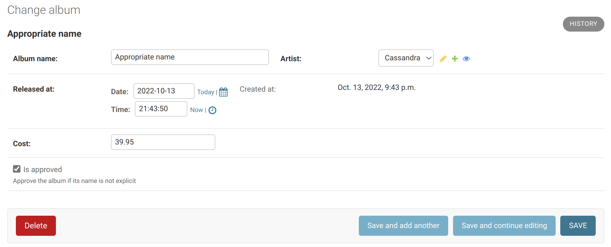
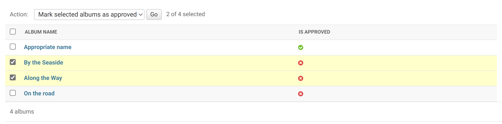
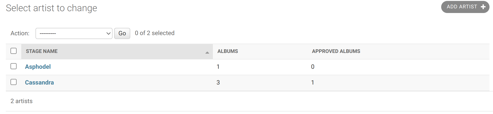

# Steps taken in populating and testing djMusic database

## [Part 1](#first-part)

## [Part 2](#second-part)

<hr>

# First Part

## Importing models

We first need to import the models from their respective modules

```python
from albums.models import Album
from artists.models import Artist
```

## Creating sample Artists

We then create two sample artists with stage names: **Cassandra** and **Asphodel** (with an empty social link)

```python
cassandra = Artist(
  stage_name='Cassandra',
  social_link='https://www.instagram.com/cassandra/'
  )

asphodel = Artist(
  stage_name='Asphodel',
  social_link=''
  )

cassandra.save()
asphodel.save()
```

## Testing Artist model queries

We apply queries for listing down the artists as required:

- List down all artists

  ```python
  >>> Artist.objects.all()

  <QuerySet [<Artist: Asphodel>, <Artist: Cassandra>]>
  ```

- List down all artists sorted by name

  ```python
  >>> Artist.objects.order_by('stage_name')

  <QuerySet [<Artist: Asphodel>, <Artist: Cassandra>]>
  ```

- List down all artists whose name starts with `a` _Notice **a** is different from **A**_

  ```python
  >>> Artist.objects.filter(stage_name__startswith='a')
  <QuerySet []>

  >>> Artist.objects.filter(stage_name__startswith='A')
  <QuerySet [<Artist: Asphodel>]>
  ```

## Creating sample Albums

We also, after importing datetime libraries, create 3 sample albums associated with the created artists:

- **On the road** (Cassandra), with creation and release dates in the past
- **Along the Way** (Cassandra), with creation date in the past and release date as today
- **By the Seaside** (Asphodel), with creation date as today and release date in the future

Here, two different ways are used to create the albums and associate them with the artists

```python
import datetime
from django.utils import timezone

on_the_road = Album(
  artist=cassandra,
  album_name='On the road',
  created = timezone.now() - datetime.timedelta(days=15),
  released_at = timezone.now() - datetime.timedelta(days=10),
  cost=39.95
  )

on_the_road.save()

along_the_way = cassandra.album_set.create(
  artist=cassandra,
  album_name='Along the Way',
  created = timezone.now() - datetime.timedelta(days=5),
  released_at = timezone.now(),

  cost=59.99
  )

by_the_seaside = Album(
  artist=asphodel,
  album_name='By the Seaside',
  released_at=timezone.now() + datetime.timedelta(days=5),
  cost=99.99
  )

by_the_seaside.save()
```

## Testing Album model queries

We apply queries for listing down the albums as required:

- Get the latest released album

  > Because there might be albums with **future release date**, we need to, first, **chop them off**, then, **sort** the remaining **descendingly** by **release date**.

  ```python
  >>> Album.objects.filter(released_at__lte=timezone.now()).order_by('-released_at')[0]

  <Album: Along the Way>
  ```

- Get all albums released before today

  ```python
  >>> today_start = timezone.localtime(timezone.now()).replace(hour=0, minute=0, second=0, microsecond=0)
  >>> Album.objects.filter(released_at__lt=today_start)

  <QuerySet [<Album: On the road>]>
  ```

- Get all albums released today or before but not after today

  ```python
  >>> next_day_start = timezone.localtime(timezone.now()+datetime.timedelta(days=1)).replace(hour=0, minute=0, second=0, microsecond=0)
  >>> Album.objects.filter(released_at__lt=next_day_start)

  <QuerySet [<Album: On the road>, <Album: Along the Way>]>
  ```

- Count the total number of albums

  ```python
  >>> Album.objects.count()
  3
  ```

- In 2 different ways, for each artist, list down all of his/her albums

  ```python
  >>> from django.db.models import Count
  >>> Album.objects.values('artist').annotate(album_count=Count('id'))
  <QuerySet [{'artist': 1, 'album_count': 2}, {'artist': 2, 'album_count': 1}]>

  >>> [
  ...   {
  ...     'artist': artist.id,
  ...     'album_count': artist.album_set.count()
  ...   }
  ...   for artist in Artist.objects.all()
  ... ]
  [{'artist': 2, 'album_count': 1}, {'artist': 1, 'album_count': 2}]

  >>> # Update on 09/10/2022
  >>> [
  ...   {
  ...     'artist': artist.id,
  ...     'album_count': artist.num_albums
  ...   }
  ...   for artist in Artist.objects.annotate(num_albums=Count('album'))
  ... ]
  [{'artist': 2, 'album_count': 1}, {'artist': 1, 'album_count': 2}]
  ```

- List down all albums ordered by cost then by name
  ```python
  >>> Album.objects.order_by('cost', 'album_name')
  <QuerySet [<Album: On the road>, <Album: Along the Way>, <Album: By the Seaside>]>
  ```

<hr>

# Second Part

## Approved albums

An **is_approved** boolean field was added to the Album Model with a default value of **False**.

```python
class Album(models.Model):
  ...
  is_approved = models.BooleanField(default=False)
```

## Add all the models to django admin

The twol models that we have should be registered by the django admin site using the following methods:

- Editing _djmusic/albums/admin.py_

  ```python
  @admin.register(Album)
  class AlbumAdmin(admin.ModelAdmin):
    ...
  ```

- Editing _djmusic/artists/admin.py_
  ```python
  @admin.register(Artist)
  class ArtistAdmin(admin.ModelAdmin):
    ...
  ```

## Creation time should be read-only

By adding the **created** field in the **readonly_fields** field of the Album, we specify that the created field should be read-only and cannot be changed by the admin as shown in the screenshot:
<br>


## Album approval help text

A help text was added to the **Is Approved** field in the Album edit and creation forms as shown in the screenshit above. This was done by overriding the default form field of the **AlbumAdmin** ModelAdmin and adding a help text to that specific **Is Approved** field.

```python
from django.utils.translation import gettext_lazy as _
class AlbumForm(forms.ModelForm):
  class Meta:
    model = Album
    exclude = []
    help_texts = {
      'is_approved': _('Approve the album if its name is not explicit')
    }

@admin.register(Album)
class AlbumAdmin(admin.ModelAdmin):
  form = AlbumForm
  ...
```

## Album approval action

An action was added to approve multiple albums at once while viewing the albums list.

```python
class AlbumAdmin(admin.ModelAdmin):
  ...
  @admin.action(description='Mark selected albums as approved')
  def make_approved(self, request, queryset):
    updated = queryset.update(is_approved=True)
    self.message_user(request, ngettext(
      "%d album was successfully approved",
      "%d albums were successfully approved", updated) % updated, messages.SUCCESS)
```

This creates a new action item in the album list admin view as in the following screenshot:


## Number of approved albums

In order to show a **approved_albums** count column for each artist in the default Artist QuerSet, a custom manager was used to modify the default QuerySet in order to **annotate** for a new column named **approved_albums** that has the count of **Album.is_approved** with a filter applied to only count the True values.

```python
class ArtistManager(models.Manager):
  def get_queryset(self):
    return super().get_queryset().annotate(approved_albums=Count('album__is_approved', filter=Q(album__is_approved=True)))

class Artist(models.Model):
  objects = ArtistManager()
  ...
```

That column can now be used in the ArtistAdmin ModelAdmin by modifying, the **fieldsets** attribute, to show the number of approved albums. Similarly, we can add the number of albums for each artist.

```python
@admin.register(Artist)
class ArtistAdmin(admin.ModelAdmin):
  ...
  list_display = ('stage_name', 'albums', 'approved_albums')
  fieldsets = (
    ...
    (None, {
      'fields': ('albums',),
      'description': 'Number of albums beloning to this artist'
    }),
    (None, {
      'fields': ('approved_albums',),
      'description': 'Number of approved albums for this artist'
    })
  )

  def albums(self, obj):
    return obj.album_set.count()

  def approved_albums(self, obj):
    return obj.approved_albums

```

This results in a artist admin page as in the following screenshot

<br>



## Order by approved albums

Now, the Artist.objects.all() returns a QuerySet of all artists with an additional column **approved_albums** that contains the number of approved albums each artist.

We can now order the artists by the number of approved albums.

<details>
<summary>If we have not already, we add a new album that is approved</summary>

```python
>>> from artists.models import Artist
>>> from albums.models import Album
>>> from django.utils import timezone
approved_album = Album(
  artist=Artist.objects.get(stage_name='Cassandra'),
  album_name='Appropriate name',
  released_at = timezone.now(),
  cost=39.95,
  is_approved=True
  )
approved_album.save()
```

</details>

<br>

Get all artists ordered by their number of approved albums ascendingly and descendingly

```python
>>> Artist.objects.order_by('approved_albums')
<QuerySet [<Artist: Asphodel>, <Artist: Cassandra>]>

>>> Artist.objects.order_by('-approved_albums')
<QuerySet [<Artist: Cassandra>, <Artist: Asphodel>]>

# Show the number of approved albums for Cassandra and Asphodel
>>> Artist.objects.get(stage_name='Cassandra').approved_albums
1
>>> Artist.objects.get(stage_name='Asphodel').approved_albums
0
```

## Allow admin to create albums within each artist page

This behavior can be achieved by adding a **admin.TabularInline** custom class to the **inlines** attribute of the **ArtistAdmin** ModelAdmin as follows:

> Here we use the **AlbumForm** custom ModelForm to apply the help text for the **Is Approved** field

```python
class AlbumInline(admin.TabularInline):
  model = Album
  readonly_fields = ('created',)
  extra = 0
  form = AlbumForm


@admin.register(Artist)
class ArtistAdmin(admin.ModelAdmin):
  inlines = [
    AlbumInline
  ]
  ...
```
