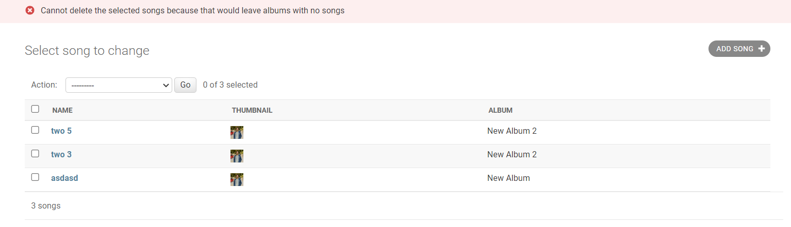
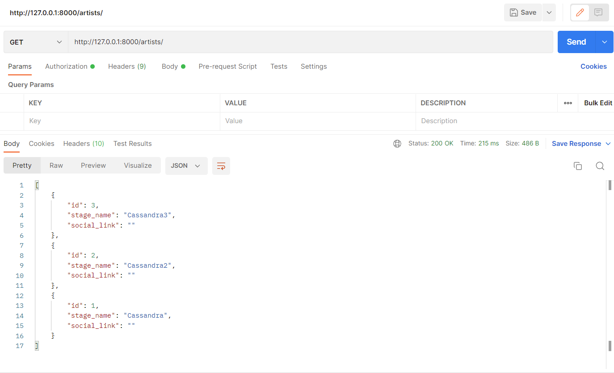
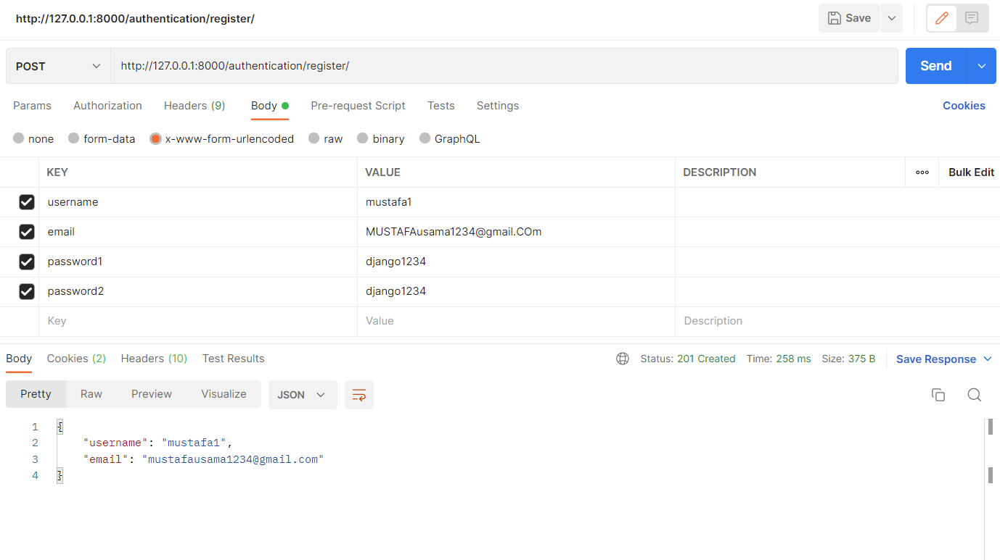
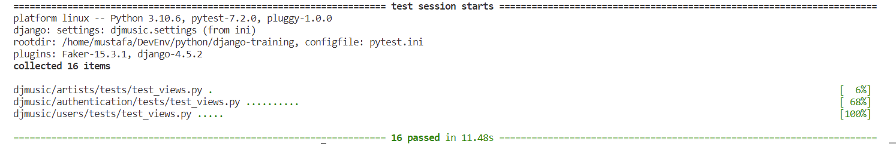

# Steps taken in populating and testing djMusic database

## [Part 1](#first-part)

## [Part 2](#second-part)

## [Part 3](#third-part)

## [Part 4](#fourth-part)

## [Part 5](#fifth-part)

## [Part 6](#sixth-part)

## [Part 7](#seventh-part)

<hr>

# First Part

## Importing models

We first need to import the models from their respective modules

```python
from albums.models import Album
from artists.models import Artist
```

## Creating sample Artists

We then create two sample artists with stage names: **Cassandra** and **Asphodel** (with an empty social link)

```python
cassandra = Artist(
  stage_name='Cassandra',
  social_link='https://www.instagram.com/cassandra/'
  )

asphodel = Artist(
  stage_name='Asphodel',
  social_link=''
  )

cassandra.save()
asphodel.save()
```

## Testing Artist model queries

We apply queries for listing down the artists as required:

- List down all artists

  ```python
  >>> Artist.objects.all()

  <QuerySet [<Artist: Asphodel>, <Artist: Cassandra>]>
  ```

- List down all artists sorted by name

  ```python
  >>> Artist.objects.order_by('stage_name')

  <QuerySet [<Artist: Asphodel>, <Artist: Cassandra>]>
  ```

- List down all artists whose name starts with `a` _Notice **a** is different from **A**_

  ```python
  >>> Artist.objects.filter(stage_name__startswith='a')
  <QuerySet []>

  >>> Artist.objects.filter(stage_name__startswith='A')
  <QuerySet [<Artist: Asphodel>]>
  ```

## Creating sample Albums

We also, after importing datetime libraries, create 3 sample albums associated with the created artists:

- **On the road** (Cassandra), with creation and release dates in the past
- **Along the Way** (Cassandra), with creation date in the past and release date as today
- **By the Seaside** (Asphodel), with creation date as today and release date in the future

Here, two different ways are used to create the albums and associate them with the artists

```python
import datetime
from django.utils import timezone

on_the_road = Album(
  artist=cassandra,
  album_name='On the road',
  created = timezone.now() - datetime.timedelta(days=15),
  released_at = timezone.now() - datetime.timedelta(days=10),
  cost=39.95
  )

on_the_road.save()

along_the_way = cassandra.album_set.create(
  artist=cassandra,
  album_name='Along the Way',
  created = timezone.now() - datetime.timedelta(days=5),
  released_at = timezone.now(),

  cost=59.99
  )

by_the_seaside = Album(
  artist=asphodel,
  album_name='By the Seaside',
  released_at=timezone.now() + datetime.timedelta(days=5),
  cost=99.99
  )

by_the_seaside.save()
```

## Testing Album model queries

We apply queries for listing down the albums as required:

- Get the latest released album

  > Because there might be albums with **future release date**, we need to, first, **chop them off**, then, **sort** the remaining **descendingly** by **release date**.

  ```python
  >>> Album.objects.filter(released_at__lte=timezone.now()).order_by('-released_at')[0]

  <Album: Along the Way>
  ```

- Get all albums released before today

  ```python
  >>> today_start = timezone.localtime(timezone.now()).replace(hour=0, minute=0, second=0, microsecond=0)
  >>> Album.objects.filter(released_at__lt=today_start)

  <QuerySet [<Album: On the road>]>
  ```

- Get all albums released today or before but not after today

  ```python
  >>> next_day_start = timezone.localtime(timezone.now()+datetime.timedelta(days=1)).replace(hour=0, minute=0, second=0, microsecond=0)
  >>> Album.objects.filter(released_at__lt=next_day_start)

  <QuerySet [<Album: On the road>, <Album: Along the Way>]>
  ```

- Count the total number of albums

  ```python
  >>> Album.objects.count()
  3
  ```

- In 2 different ways, for each artist, list down all of his/her albums

  ```python
  >>> from django.db.models import Count
  >>> Album.objects.values('artist').annotate(album_count=Count('id'))
  <QuerySet [{'artist': 1, 'album_count': 2}, {'artist': 2, 'album_count': 1}]>

  >>> [
  ...   {
  ...     'artist': artist.id,
  ...     'album_count': artist.album_set.count()
  ...   }
  ...   for artist in Artist.objects.all()
  ... ]
  [{'artist': 2, 'album_count': 1}, {'artist': 1, 'album_count': 2}]

  >>> # Update on 09/10/2022
  >>> [
  ...   {
  ...     'artist': artist.id,
  ...     'album_count': artist.num_albums
  ...   }
  ...   for artist in Artist.objects.annotate(num_albums=Count('album'))
  ... ]
  [{'artist': 2, 'album_count': 1}, {'artist': 1, 'album_count': 2}]
  ```

- List down all albums ordered by cost then by name
  ```python
  >>> Album.objects.order_by('cost', 'album_name')
  <QuerySet [<Album: On the road>, <Album: Along the Way>, <Album: By the Seaside>]>
  ```

<hr>

# Second Part

## Approved albums

An **is_approved** boolean field was added to the Album Model with a default value of **False**.

```python
class Album(models.Model):
  ...
  is_approved = models.BooleanField(default=False)
```

## Add all the models to django admin

The twol models that we have should be registered by the django admin site using the following methods:

- Editing _djmusic/albums/admin.py_

  ```python
  @admin.register(Album)
  class AlbumAdmin(admin.ModelAdmin):
    ...
  ```

- Editing _djmusic/artists/admin.py_
  ```python
  @admin.register(Artist)
  class ArtistAdmin(admin.ModelAdmin):
    ...
  ```

## Creation time should be read-only

By adding the **created** field in the **readonly_fields** field of the Album, we specify that the created field should be read-only and cannot be changed by the admin as shown in the screenshot:
<br>


## Album approval help text

A help text was added to the **Is Approved** field in the Album edit and creation forms as shown in the screenshit above. This was done by overriding the default form field of the **AlbumAdmin** ModelAdmin and adding a help text to that specific **Is Approved** field.

```python
from django.utils.translation import gettext_lazy as _
class AlbumForm(forms.ModelForm):
  class Meta:
    model = Album
    exclude = []
    help_texts = {
      'is_approved': _('Approve the album if its name is not explicit')
    }

@admin.register(Album)
class AlbumAdmin(admin.ModelAdmin):
  form = AlbumForm
  ...
```

## Album approval action

An action was added to approve multiple albums at once while viewing the albums list.

```python
class AlbumAdmin(admin.ModelAdmin):
  ...
  @admin.action(description='Mark selected albums as approved')
  def make_approved(self, request, queryset):
    updated = queryset.update(is_approved=True)
    self.message_user(request, ngettext(
      "%d album was successfully approved",
      "%d albums were successfully approved", updated) % updated, messages.SUCCESS)
```

This creates a new action item in the album list admin view as in the following screenshot:


## Number of approved albums

In order to show a **approved_albums** count column for each artist in the default Artist QuerSet, a custom manager was used to modify the default QuerySet in order to **annotate** for a new column named **approved_albums** that has the count of **Album.is_approved** with a filter applied to only count the True values.

```python
class ArtistManager(models.Manager):
  def get_queryset(self):
    return super().get_queryset().annotate(approved_albums=Count('album__is_approved', filter=Q(album__is_approved=True)))

class Artist(models.Model):
  objects = ArtistManager()
  ...
```

That column can now be used in the ArtistAdmin ModelAdmin by modifying, the **fieldsets** attribute, to show the number of approved albums. Similarly, we can add the number of albums for each artist.

```python
@admin.register(Artist)
class ArtistAdmin(admin.ModelAdmin):
  ...
  list_display = ('stage_name', 'albums', 'approved_albums')
  fieldsets = (
    ...
    (None, {
      'fields': ('albums',),
      'description': 'Number of albums beloning to this artist'
    }),
    (None, {
      'fields': ('approved_albums',),
      'description': 'Number of approved albums for this artist'
    })
  )

  def albums(self, obj):
    return obj.album_set.count()

  def approved_albums(self, obj):
    return obj.approved_albums

```

This results in a artist admin page as in the following screenshot

<br>


## Order by approved albums

Now, the Artist.objects.all() returns a QuerySet of all artists with an additional column **approved_albums** that contains the number of approved albums each artist.

We can now order the artists by the number of approved albums.

<details>
<summary>If we have not already, we add a new album that is approved</summary>

```python
>>> from artists.models import Artist
>>> from albums.models import Album
>>> from django.utils import timezone
approved_album = Album(
  artist=Artist.objects.get(stage_name='Cassandra'),
  album_name='Appropriate name',
  released_at = timezone.now(),
  cost=39.95,
  is_approved=True
  )
approved_album.save()
```

</details>

<br>

Get all artists ordered by their number of approved albums ascendingly and descendingly

```python
>>> Artist.objects.order_by('approved_albums')
<QuerySet [<Artist: Asphodel>, <Artist: Cassandra>]>

>>> Artist.objects.order_by('-approved_albums')
<QuerySet [<Artist: Cassandra>, <Artist: Asphodel>]>

# Show the number of approved albums for Cassandra and Asphodel
>>> Artist.objects.get(stage_name='Cassandra').approved_albums
1
>>> Artist.objects.get(stage_name='Asphodel').approved_albums
0
```

## Allow admin to create albums within each artist page

This behavior can be achieved by adding a **admin.TabularInline** custom class to the **inlines** attribute of the **ArtistAdmin** ModelAdmin as follows:

> Here we use the **AlbumForm** custom ModelForm to apply the help text for the **Is Approved** field

```python
class AlbumInline(admin.TabularInline):
  model = Album
  readonly_fields = ('created',)
  extra = 0
  form = AlbumForm


@admin.register(Artist)
class ArtistAdmin(admin.ModelAdmin):
  inlines = [
    AlbumInline
  ]
  ...
```

# Third Part

In the third part of the application, two forms were added allowing the user to create artists and albums.
A slight modification was done to the Album model in order to timestamp it.

## Album model timestamp

The Album model now inherits from **TimeStampedModel** which adds **created** and **modified** fields that are filled automatically based on every change in the database and according to the timezone.

## Artist and Album creation form

Two creation forms were made available for the user to fill and create a new Artist or Album.  
First, two forms were created that inherit the django Form class.

```python
# artists/forms.py
class CreateArtistForm(forms.Form):
  stage_name = forms.CharField(label='Stage Name', max_length=200)
  social_link = forms.CharField(label="Social Link", required=False)
...
# albums/forms.py
class CreateAlbumForm(forms.ModelForm):
  class Meta:
    model = Album
    fields = ['artist', 'album_name', 'released_at', 'cost']
    widgets = {
      'released_at': forms.DateTimeInput(attrs={'type': 'datetime-local'})
    }
```

Then, the forms were used in the view of the url pattern **'/artists/create'**, **'/albums/create'**, respectively, in 3 different ways.

- If it is the first time to visit the form page, the form will be empty expecting the used to enter a new artist or album data.
- If the page is visited after a submit button was clicked (POST request), the data is validated and leads to either of the following situations:
  - If the validation succeeded, the Artist/Album will be created, and the user will be redirected to the list of artists page.
  - If the validation failed, messages with the instructions will appear in red above the Creation form and in each failed field.

## User friendly datetime picker

A user-friendly datetime picker was created in the Album creation form, in order to allow for an easy selection of the release date and time.


## Form validation

Form validation is done by the django Form class which yields errors when the input is not valid. Another form validation is done by the developer such as checking whether the artist name being created exists or not (as shown in the left image below).

|                  Artists                   |                   Albums                   |
| :----------------------------------------: | :----------------------------------------: |
|  |  |

## Artist list page

An artist list page was created to list all the artists along with the albums associated with each of them. A generic List View was used to first fetch the items, apply modification to the context, and consume the context in the template to view it accordingly.

An efficient database query was performed to fetch all the artists with their albums using SQL join under the hood in only one query without having to loop over all the artists and fetch the albums for each one separately.

```python
def get_queryset(self):
  # Selection with join
  return \
    Artist.objects.all().prefetch_related('album_set').order_by('id') \
    .values('id', 'stage_name', 'social_link', 'album__id', 'album__album_name', 'album__created', 'album__released_at', 'album__cost')
```

Then, the entries returned from the database were modifed in order to create a dictionary with each key corresponding to each artist's stage_name with the value being a dictionary that includes the information of the artist along with an array of all of their albums, as in the following format.

```python
context = {
  'STAGE_NAME1': {
    'id': ARTIST_ID,
    'social_link': ARTIST_SOCIAL_LINK,
    'albums': [
      {
        'album__id': ALBUM_ID,
        'album__album_name': ALBUM_NAME,
        'album__created': ALBUM_CREATION_DATETIME,
        'album__released_at': ALBUM_RELEASE_DATETIME,
        'album__cost': ALBUM_COST,
      },
      ...
    ]
  },
  'STAGE_NAME2': {},
  ...
}
```

That context is processed in and returned from the **get_context_data** method of the generic view. The template receives and parses it in order to display the artists data as follow:


# Fourth Part

## Class-based views
Album and Artist creation forms were converted to class-based views in order to make use of the FormView class. In the **CreateArtistView** and **CreatAlbumView** classes, the **form_valid** and **form_invalid** methods were used to validate and confirm the form.

```python
class Create_____View(FormView):
  def form_valid(self, form):
    ...

  def form_invalid(self, form):
    ...
```


## Login and logout
A login view and a logout URL were added to the project's urls in order to allow for signing users in and out.
```python
urlpatterns = [
    ...
    path("accounts/login/", auth_views.LoginView.as_view(), name='login'),
    path("accounts/logout/", auth_views.LogoutView.as_view(), name='logout')
]
```

## Authorization
Only authenticated users were allowed to access the creation forms for albums and artists. A **login_required** decorator was added for each of the form views to only allow for logged in users to use them.
```python
## albums/urls.py
urlpatterns = [
  path('create/', login_required(views.CreateAlbumView.as_view()), name='create')
]

## artists/urls.py
urlpatterns = [
  path('create/',  login_required(views.CreateArtistView.as_view()), name='create'),
  ...
]
```

## The album inline form was deleted from Artist admin form

## Song model
The song model was created as required to contain the fields:
- **album**: foreign key to the album id
- **name**: not required and if empty it would default to the album name
- **image**: image field that is require not to be null
- **image_thumbnail**: a processed version of the image to reduce its size to a thumbnail size
  - **I agree that image_thumbnail is important because it caches the original image and optimizes the performance significantly**
- **audio**: a file that has a validator to accept certain extensions

The song model contains multiple methods for added features:
- **save** (override): this method overrides the save method of the queryset to fill the song name with the album name if the song name is empty or not provided
- **image_tag** and **audio_tag**: these two methods provide html tags for the thumbnail and the audio file to be visible and playable on the admin view
- **delete** (override): this method overrides the **single** delete method in order to check whether the album has only one song or not and perform deletion if the later is true. It also performs file cleanup after deletion
- **SongDeleteQuerySet.delete**: this overrides the default object manager to add the delete method for the bulk deletion to check for wether the album will have only one song after deletion or not and perform the deletion if the later is true. It also performs file cleanup after deletion
- **validate_audio_file_extension**: this validator validates the uploaded file extension to only allow **.mp3** and **.wav**

## Media files
**MEDIA_ROOT** and **MEDIA_URL** configurations where added to the settings to allow for the media to be uploaded to and server from the specified file paths.
```python
MEDIA_ROOT  = os.path.join(BASE_DIR, 'media')
MEDIA_URL = '/media/'
```
They were also added to the site URLs to allow access to them by using the URL.
```python
urlpatterns = [
  ...
] + static(settings.MEDIA_URL, document_root=settings.MEDIA_ROOT)
```

The **media** directory was added to the **.gitignore** file

## 1-or-more relationship
A 1-or-more relationship was achieved between the Song and the Album models where each Album must have at least one song. That relationship was achieved by adding custom validations to the major aspects of the applications that deal with the albums and songs.  
1. First, a custom SongInlineFormset was added to the custom inline of the Album modeladmin.
2. A **clean** method was added to override the behavior of the formset.
   - It does not allow creation of albums without added songs
     
   - It also does not allow deletion if the number of songs per the specific album will be zero.
     
3. A **delete_queryset** was overridden to expect an exception in bulk deletion and, accordingly, show error messages or confim deletion. That exception is thrown by the **pre_delete** signal receiver which has the logic for checking wether the albums will have zero songs after deletion.
   
4. The **delete_model** was overridden to expect an exception in single model deletion and, accordingly, show error message or confim deletion
   The following message is shown after clicking the Delete button inside the **New song** view
   

# Fifth Part

## REST APIs
Django Rest Framework (DRF) was installed to allow for adding REST API views.  
The `'rest_framework'` was added to the **INSTALLED_APPS** of `settings.py`

## Serializer
A ModelSerializer was used to add an abstraction layer to the create(), update(), and the validation methods.  
The ArtistSerializer was associated with the Artist model.

```python
from rest_framework import serializers
from .models import Artist

class ArtistSerializer(serializers.ModelSerializer):
  class Meta:
    model = Artist
    fields = ['id', 'stage_name', 'social_link']
```

## URLs
The **urlpatterns** variable of the artists app was modified to add an /old/ endpoint to all the old views, and to associate the index endpoint to the REST API view.
```python
urlpatterns = [
  path('', views.ArtistsView.as_view(), name='json_list'),
  path('old/create/',  login_required(views.CreateArtistView.as_view()), name='create'),
  path('old/', views.ArtistListView.as_view(), name='list')
]
```

Also, a suffix format was added to allow for suffixes such as `.json` in the url.
```python
from rest_framework.urlpatterns import format_suffix_patterns
urlpatterns = format_suffix_patterns(urlpatterns)
```

## REST API View
A class-based rest_frameword generic ListCreateAPIView was used in order to add an abstraction to the **get** and **post** methods of the api.

```python
class ArtistsView(generics.ListCreateAPIView):
  queryset = Artist.objects.all()
  serializer_class = ArtistSerializer
  # TODO: Authorization configuretion
```

* Using the REST API View
  > Notice that, without logging in, the user can create artists using a POST request. This behavior will be restricted in the next section

  
* GET request Using Postman  
  
* POST request using Postman (without authorization)
  
* POST request using Postman (with validation error)
  
## Authentication
An authentication-is-required feature was added to the artist creation endpoint (**POST** request) in order not to allow for unauthenticated users to create artists by adding **permission_classes** property to the **ArtistsView**. This will allow unauthenticated users to use the API's GET method, and only authenticated users to use the API's POST method.

```python
class ArtistsView(generics.ListCreateAPIView):
  queryset = Artist.objects.all()
  serializer_class = ArtistSerializer
  permission_classes = [permissions.IsAuthenticatedOrReadOnly]
```

* Using the REST API View
  > Notice that the REST API view does not allow post request when the user is not logged in

  

* Using the REST API View
  > Notice that the REST API view allows post request when the user is logged in

  

* Using Postman (without login)
  > Notice that the response has a 403 status with the detail field being the authentication error details.

  

* Using Postman (with login)  
  1. Using the username and password (basic auth) in the authorization header
  
  2. POST request works only with successful authorization
  

# Sixth Part
## Disabled authorization views/apps
## Users app
* A users app was created. It has a User model that overrides the **AbstractUser** model with an addition of one field **bio** which is an optional CharField with a max of 265 characters.
* A custom **UserAdmin** model admin was used and registerd in the admin panel. That model admin uses a custom form **UserModelForm** to show the bio of the user in a textarea instead of a text input.
  ```python
  class UserModelForm(forms.ModelForm):
    bio = forms.CharField(widget=forms.Textarea)
    class Meta:
        model = User
        fields = '__all__'
        exclude = ('password', 'last_login', 'date_joined')

  class UserAdmin(admin.ModelAdmin):
    form = UserModelForm

  admin.site.register(User, UserAdmin)
  ```
  

## Authentication app
An authentication app was created. This app uses some functionality provided by **Django Rest Framework** and **Django Rest Knox**.

## Registration
A **RegisterSerializer** was created to verify and confirm registration via the api endpoint **/authentication/register/**.
* The serializer accepts 4 fields: **Username** (required), **Email** (optional), **Password1** (required), **Password2** (required).
  
* The serializer, firstly, performs validation on each field separately.
  - Username field has to be unique (not existing in the database)
  - Email field, if provided, has to be unique (it does so by case insensitive comparison)
    
  - Password1 has to be strong
    
  - Password2 has to be provided
* The serializer then performs overall validation to make sure that the two passwords match
  
* The serializer, finally, attempts to create a new user with the provided details (after lowecase-ing the email and hashing the password) and returns the created user.
  

A **RegisterView** was created. It inherits **CreateAPIView** generic view with **AllowAny** permission and association with the **RegisterSerializer**.
```python
class RegisterView(generics.CreateAPIView):
  permission_classes = [permissions.AllowAny]
  serializer_class = RegisterSerializer
```

## Login
A **LoginView** was created. It inherits **knox.views.LoginView**. It only accepts **POST** requests at the endpoint **/authorization/login/**.
* It uses the **AuthTokenSerializer** provided by Django Rest Framework to validate the POST request. It returns a respnse with the error, if any.
  
* It creates a user object with the user credentials and calls the login method provided by django.
* It then creates and returns an object with the user token and the user details.
  

The knox token can be used afterwards in any request that required authorization.

## Logout
A **LogoutView** was created. It inherits **knox.views.LogoutView**. It only accepts **POST** requests at the endpoint **/authorization/login/**.  
* It accepts an Authorization header with the token to be invalidated.
* First, it validates the token, and it returns a response with the error, if any.
  
* If the token is correct, it responds with 204 No Content and it invalidates the token provided.
  

## User Details
A **UserDetailView** was created. It inherits the DRF generic view **RetrieveUpdateAPIView**. It only accepts **GET**, **PUT**, and **PATCH** requests at the endpoint **/users/\<int:pk\>/**.  


By default, the **RetrieveUpdateAPIView** allows retrieving the entry with the primary key provided (user here) with **GET**, updating a single field with **PATCH**, and updating the whole entry with **PUT**.

```python
class UserDetailView(generics.RetrieveUpdateAPIView):
  serializer_class = UserSerializer
  queryset = User.objects.all()
  permission_classes = [IsAuthenticatedOrReadOnly]
```

Since we need authorization in the case of updating, a custom permission **IsAuthenticatedOrReadOnly** was created to validate or invalidate the update request.
The permission inherits the **BasePermission** of **DRF**. The permission passes all GET requests, and it allows PUT and PATCH requests only if the authenticated user is the user being updated.
```python
class IsAuthenticatedOrReadOnly(BasePermission):
  AuthMethods = ['PUT', 'PATCH']
  def has_permission(self, request, view):
    if(request.method in self.AuthMethods):
      if((not request.user) or
        (not request.user.is_authenticated) or
        (request.user.id != view.kwargs['pk'])):
        return False

    return True
```

* It allows retrieval of the provided user without authroization.
  
* It does not allow applying modifications on the user without authorization and without the API sender being the to-be-updated user theirselves.
  
* PUT request requires all the fields to update the whole user entry in the databse. It returns the updated user entry
  
* PATCH requests updates the fields provided and does not require any specific field. It returns the updated user entry.
  

## Default Authentication
The knox TokenAuthentication was added to the defaul authentication classes in the beginning to allow it to work.
```python
REST_FRAMEWORK = {
    'DEFAULT_AUTHENTICATION_CLASSES': ('knox.auth.TokenAuthentication',),
}
```

# Seventh Part
## Pytest configurations
First, pytest configurations were writtem in **pytest.ini** file.
```ini
[pytest]
DJANGO_SETTINGS_MODULE = djmusic.settings
python_files = test_*.py *_tests.py
pythonpath = djmusic
filterwarnings = ignore::DeprecationWarning
```
- **DJANGO_SETTINGS_MODULE** tells pytest where to find the django settings for testing
- **python_files** tells pytest the file name pattern to look for
- **pythonpath** tells pytest the directory it should make the python path in (djmusic/ directory here)
- **filterwarnings** tells pytest to filter out some warnings (deprecation warnings here)

## Users app testing
### Fixtures
Two fixtures were created in the **conftest.py** file of the Users app.
- **auth_client** fixture provides a function that receives a user instance or None and returned an APIClient authenticated with the provided instance or unauthneticated
- **create_users** fixture provides a function that receives a number (or defaults to 3), does n-user bulk creation with the random values and returns the created users.

### Test Cases
Many test cases were created to test the overall functionality of the Users app.
- **test_unauthenticated_user_view** tests that the user view should respond with a user data the correspond to the specified user id in the url
- **test_unauthorized_user_update** tests that any guest or any user (other than the user in the id parameter) should never be able to update the user with the specified id in the url
- **test_authorized_user_update** tests that only the user with the id paramter should be able to update its own details.
- **test_invalid_user_update** tests that the user cannot update its details with invalid details (e.g. invalid email)
- **test_incomplete_user_update** tests that a **PUT** request requires all the critical user details (as a put request requires all the fields to be updated unlike a patch request that strictly requires no fields)

## Authentication app testing
### Fixtures
Two fixtures were created in the **conftest.py** file of the Authentication app.
- **auth_client** fixture provides a function that receives a user instance or None and returned an APIClient authenticated with the provided instance or unauthneticated
- **create_users** fixture provides a function that receives a number (or defaults to 3), does n-user bulk creation with the random values and returns the created users.

### Test Cases
Many test cases were created to test the overall functionality of the Authentication app.
- **test_user_register_with_insufficient_fields** tests that any guest cannot register without the 3 required fields (username, password1, password2)
- **test_user_register_with_invalid_details** tests that any guest cannot register with a username that is already taken, an email, if provided, that is already taken, or a weak password.
- **test_user_register_with_no_second_password** tests that any guest cannot register without providing the password2 field
- **test_user_register_with_no_matching_password** tests that any guest cannot register wihtout providing a matching password2 field to the password1 field.
- **test_user_register_correctly** tests that any guest should be able to register, if provided correct fields, and have a response with its user instance details.
- **test_user_login_incomplete_credentials** tests that any guest cannot login without the 3 required fields (username, password)
- **test_user_login_invalid_credentials** tests that any gues cannot login with invalid credentials
- **test_user_login_correctly** tests that any guest should be able to login, if provided correct fields, and have a response with its token and user instance details.
- **test_user_logout_incomplete** tests that any guest cannot logout wihtout providing their token.
- **test_user_logout_correctly** tests that any guest can logout, if provided correct token, and receive a 204 No Content response.

## Artists app testing
### Fixtures
Two fixtures were created in the **conftest.py** file of the Artists app.
- **auth_client** fixture provides a function that receives a user instance or None and returned an APIClient authenticated with the provided instance or unauthneticated
- **create_artists** fixture provides a function that receives a number (or defaults to 3), does n-artist bulk creation with the random values and returns the created artists.

### Test Cases
- **test_artists_view** tests that the artist view returns a list of all the artists in the database.

## Running tests
After running `poetry run pytest`, the following result was printed.

> 